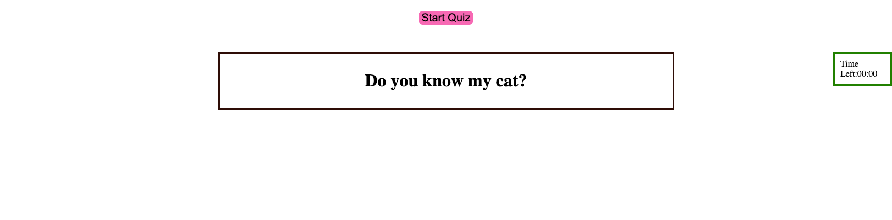
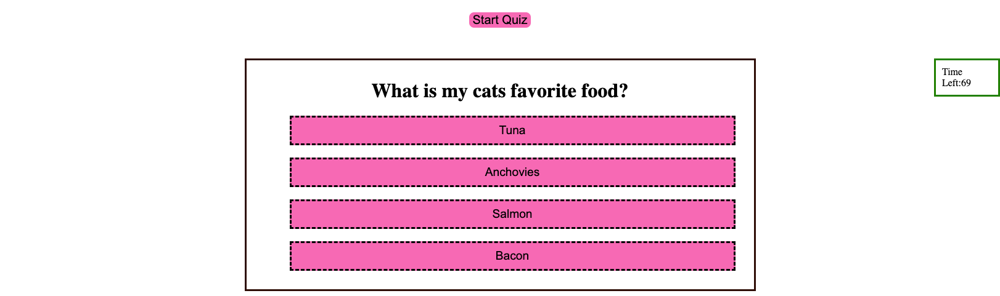
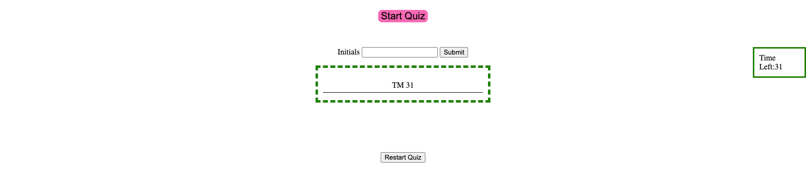

# Code-Quiz-4000

## Technology Used

| Technology Used         | Resource URL           | 
| ------------- |:-------------:| 
| HTML    | [https://developer.mozilla.org/en-US/docs/Web/HTML](https://developer.mozilla.org/en-US/docs/Web/HTML) | 
| CSS     | [https://developer.mozilla.org/en-US/docs/Web/CSS](https://developer.mozilla.org/en-US/docs/Web/CSS)      |   
| Git | [https://git-scm.com/](https://git-scm.com/)     |    
| JavaScript | [https://developer.mozilla.org/en-US/docs/Web/JavaScript](https://developer.mozilla.org/en-US/docs/Web/JavaScript)

## Description

[Visit the Deployed Site!](https://thomasmunzar.github.io/Code-Quiz-4000/)

The goal of this project was to create a quiz that ran smoothly for a user. As simple as it looks and as silly as the questions are, the mechanic behind this program were tricky. Styling the quiz page was the fun part since it is so simple but using JavaScript to make the page interactive was tough for me.  The goal was to make a simple quiz, I did not worry too much about the question at hand (although I think thats not great for the user since only I know the questions answers about my cat). I focused all my time on JavaScript and its functionality. I started creating variable based on items I had in my HTML document so that i could manipulate and use those elements as i needed. then i created a timer that counts from 75 down to 0 when the user clicks "start quiz".  This took me quite some time to figure out how to write but i eventually got it. i then created functions to start the game, move to the next question and end the game.

This was so much harder than I initially thought it would be and was quite humbling. 

## Usage

The user is prompted with a pretty plain page, the only option there is is to press the "start-quiz" button
Then the user will answer a series of questions about my cat
Then the user will either finish answering the questions or run out of time and a "enter initials" and high score box will display. You can hit "restart-quiz" and re do the quiz and you hig scores will be save.

here are some screen shots:







## Learning Points

I learned alot from this assignment. Mainly I learned that it is extremely important to organize your HTML (again) but I also took away that
if you do it correctly, JavaScript really can have a flow to it. It is still really comfusing for me to look at most of the time but if I take the time to really break down each variable, each function, and correlate it to the HTML then it is a bit easier to understand. Just going back and forth on this project and fixing one thing, and then being encountered by 2-5 more bugs after fixing 1 bug taught me a TON.

A proud moment for me was fixing a bug where the initial were not being stored in the highscore box immidiateley. After some research I realized i needed my displayHighScore () function IN my saveInitials() function.

Also I couldnt figure out how to restart the quiz with out refreshing the page so after some research I decided to create a new but in HTML:

```HTML
<div id="restart-container" class="hide">
        <button id="restart-btn">Restart Quiz</button>
    </div>
```

```S
function restartQuiz(){
    window.location.reload()
}

restartButton.addEventListener('click', restartQuiz)
```
I was proud of this little bit of code because I didnt feel totally lost when I wrote it and did it with out outside help. 

## Author Info

### Thomas Munzar

* [Portfolio](https://thomasmunzar.github.io/portfolio-thomas/)
* [LinkedIn](https://www.linkedin.com/in/thomas-munzar-659b51250/)
* [Github](https://github.com/ThomasMunzar)

##
Thank you to my fellow classmates, teachers, TA's, Tutors for helping me and creating a supportive community.

## License
MIT License

Copyright (c) [2023] [Thomas Munzar]

Permission is hereby granted, free of charge, to any person obtaining a copy
of this software and associated documentation files (the "Software"), to deal
in the Software without restriction, including without limitation the rights
to use, copy, modify, merge, publish, distribute, sublicense, and/or sell
copies of the Software, and to permit persons to whom the Software is
furnished to do so, subject to the following conditions:

The above copyright notice and this permission notice shall be included in all
copies or substantial portions of the Software.

THE SOFTWARE IS PROVIDED "AS IS", WITHOUT WARRANTY OF ANY KIND, EXPRESS OR
IMPLIED, INCLUDING BUT NOT LIMITED TO THE WARRANTIES OF MERCHANTABILITY,
FITNESS FOR A PARTICULAR PURPOSE AND NONINFRINGEMENT. IN NO EVENT SHALL THE
AUTHORS OR COPYRIGHT HOLDERS BE LIABLE FOR ANY CLAIM, DAMAGES OR OTHER
LIABILITY, WHETHER IN AN ACTION OF CONTRACT, TORT OR OTHERWISE, ARISING FROM,
OUT OF OR IN CONNECTION WITH THE SOFTWARE OR THE USE OR OTHER DEALINGS IN THE
SOFTWARE.